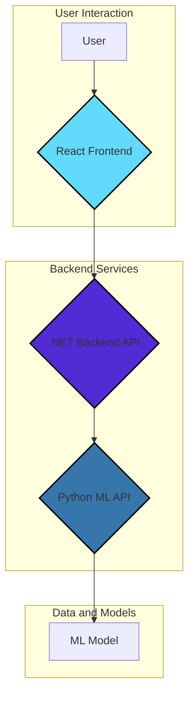

# Churn Prediction Platform

*Disclaimer* - Most of the code in this repo is boilerplate, and was generated by an LLM. The purpose of this repo was to familiarize myself with these libraries and tools, and connecting end-to-end systems.

A full-stack application to predict customer churn using a machine learning model. It features a React frontend, a .NET backend, and a Python ML service, all containerized with Docker and deployed to Azure.

---

## Live Application

*   **Frontend:** [https://churnstorage1175.z19.web.core.windows.net/](https://churnstorage1175.z19.web.core.windows.net/)
*   **Backend API:** [https://churn-backend-devbjackson.azurewebsites.net/swagger](https://churn-backend-devbjackson.azurewebsites.net/swagger)
*   **ML API:** [https://churn-api-devbjackson.azurewebsites.net/docs](https://churn-api-devbjackson.azurewebsites.net/docs)

---

## Architecture

The platform is composed of three main services that work together:



1.  **React Frontend**: The user-facing application for submitting customer data for churn prediction.
2.  **.NET Backend API**: Handles requests from the frontend, logs prediction queries, and communicates with the Python ML service.
3.  **Python ML API**: A FastAPI service that serves predictions using a pre-trained scikit-learn model.

---

## Technologies Used

-   **Frontend**: React, JavaScript
-   **Backend**: C# / .NET 8
-   **ML Service**: Python, FastAPI, Scikit-learn
-   **Containerization**: Docker, Docker Compose
-   **CI/CD**: GitHub Actions
-   **Cloud Provider**: Microsoft Azure (App Service)

---

## Features

- **Data Preprocessing**: Handles missing values, encodes categorical features, and scales numerical features.
- **Model Training**: Logistic Regression model trained on customer churn data.
- **Python ML API**: FastAPI-based REST API for serving ML predictions.
- **C# Backend API**: ASP.NET Core backend that communicates with the Python ML service.
- **React Frontend**: A user-friendly interface built with React to interact with the prediction service. Users can input customer data manually, load sample or random data, and receive real-time churn predictions with confidence scores.
- **Multi-Service Architecture**: Microservices architecture with separate Python ML, C# backend, and React frontend services.
- **Docker Compose Support**: Complete containerization with service orchestration.
- **Production-Ready**: Saves trained model and column structure for consistent predictions on new data.

---

## Installation

### **Clone the Repository**
```bash
git clone https://github.com/devbjackson/churn-prediction-platform.git
cd churn-prediction-platform
```

---

## Usage

The recommended way to run the platform is with Docker Compose. This will handle everything from training the model to running the services.

### **1. Train the Model**

Run the following command to train the model using a temporary Docker container:

```bash
docker-compose run --build python-api-train
```

This will generate the `churn_model.joblib` and `model_columns.joblib` files.

### **2. Run the Platform**

Once the model is trained, start the platform:

```bash
docker-compose up --build
```

This will start:
- **React Frontend** on port `3000` (http://localhost:3000)
- **Python ML API** on port `8000`
- **C# Backend API** on port `8001`

You can access the web interface by navigating to `http://localhost:3000`.

---

## File Structure

- **Notebook.ipynb**: Jupyter notebook for data preprocessing and model training.
- **main.py**: FastAPI application for serving predictions.
- **train.py**: Script for training the model.
- **requirements.txt**: List of dependencies for the Python service.
- **Dockerfile**: Docker configuration for the Python application.
- **docker-compose.yaml**: Docker Compose configuration for multi-service deployment.
- **ChurnPlatform.Backend/**: C# ASP.NET Core backend service.
- **frontend/**: React frontend application.
- **.github/workflows/main.yml**: GitHub Actions workflow for CI/CD.
